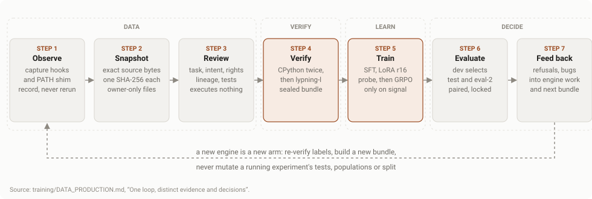
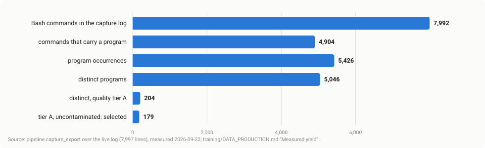
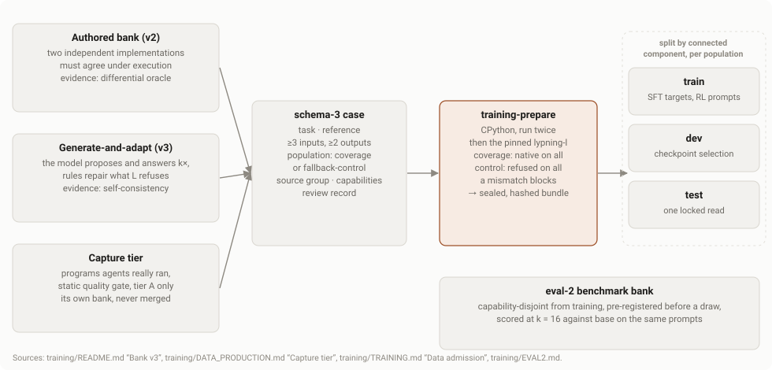
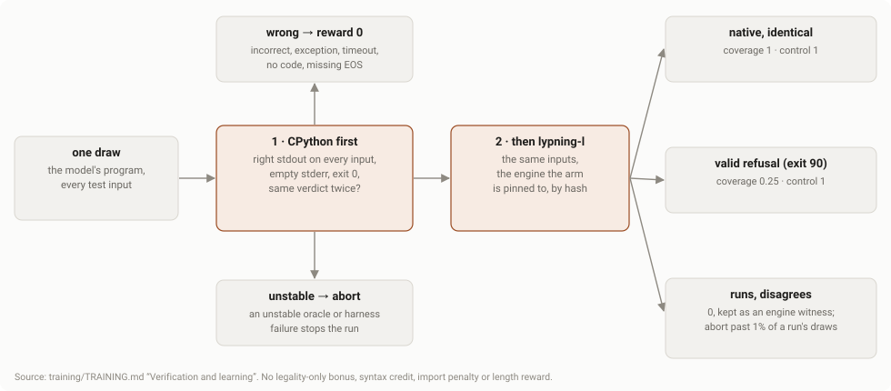
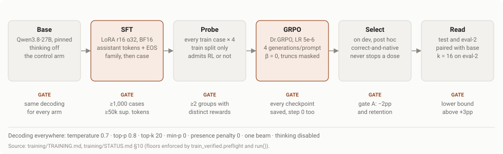
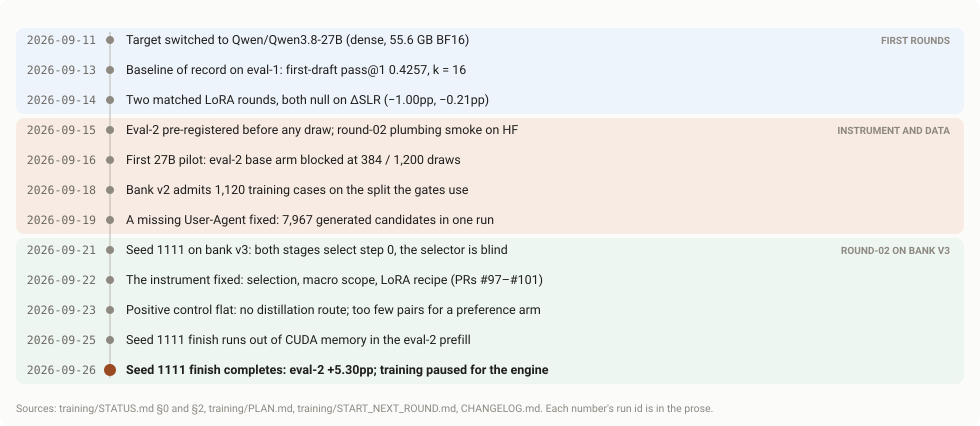
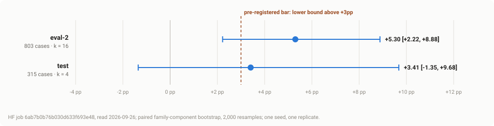
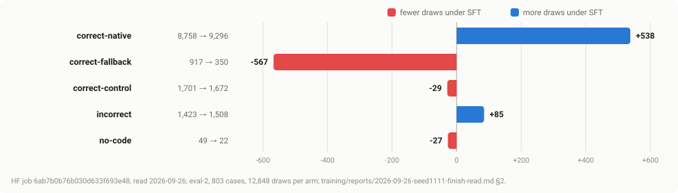

# Model training: from captured programs to a fine-tuned model

The second way to raise the share of agent Python that `lypning-l` answers by
itself: instead of teaching the engine more Python, teach the model to write
the Python the engine already runs. This page is the whole pipeline in one
place, end to end — where the data comes from, how a case is admitted, how a
draw is graded, how the model is trained and how a result is read — with a
figure for each stage. It is a map, not a second copy: every mechanism has its
home under `training/`, named in each section and in the index at the end, and
those files win wherever this page is shorter than they are.

**State on 2026-10-02.** Training is **paused** for engine coverage (operator
decision, 2026-09-26) and resumes as a new arm on the next `lypning-l`
(`training/START_NEXT_ROUND.md`, then `training/ENGINE_BUMP.md`, then
`training/RAMP.md`). The latest result is one seed: eval-2 correct-and-native
**+5.30pp [+2.22, +8.88]**, correctness flat, gates A–C passed, the
pre-registered bar not met (§9).

Every number on this page carries its run and its date, as root `CLAUDE.md`
invariant 3 requires; none is a new measurement. Quote the run, not this page.

## 1. The goal, and the one number that would show it

Adapt `Qwen/Qwen3.8-27B` so that an agent with **no knowledge that lypning
exists** writes ordinary first-draft programs that `lypning-l` runs natively at
a rate materially above the base model — **without getting more answers
wrong**, without dropping imports the engine serves, and without writing longer
programs (`training/STATUS.md` §1).

The number is the paired change in the **correct-and-native first-draft rate**
on eval-2, a benchmark of unconditioned ordinary tasks, averaged over draws,
then cases, then families. It is read beside three gates (`training/EVAL2.md`
§4, `training/PREREGISTRATION.md` §7c):

| gate | holds when |
| --- | --- |
| A — correctness | the all-family correctness macro falls by no more than 2pp against base |
| B — import retention | supported imports are kept at no less than 0.80× the base rate |
| C — length | mean completion tokens rise by no more than 20% |

**The win rule, fixed before any run:** the 95% interval's lower bound must sit
above **+3pp** (`training/PREREGISTRATION.md` §7b, 2026-09-14). The target is
not rewrite compliance, fewer imports, shorter source, or native execution of a
wrong program — a model that hand-rolls SHA-256 instead of importing `hashlib`
must score zero, and does. That is the training-side form of the project's
first rule: a refusal beats a wrong answer.

## 2. The loop at a glance

<figure>

<figcaption>The loop. Evidence, review, verification and learning are separate stages with separate identities; a new engine starts a new arm rather than editing a running one.</figcaption>
</figure>

Seven stages, and the separation between them is the point
(`training/DATA_PRODUCTION.md`): capture is not permission to rerun, review
executes nothing, verification happens in fresh containers before anything is
trained, and a failed learning stage never licenses weakening correctness. What
training cannot fix — refusals that keep recurring, engine bugs it finds — goes
back into engine work, which is why the programme is paused today.

## 3. Data collection: what agents actually ran

The raw material is the same capture feed that grows the conformance corpus
([capture](capture.html)): Claude Code, OpenHands and opencode hooks and a
`python3` PATH shim record the Python an agent ran, privately, on the machine it
ran on.

- **Snapshot, losslessly.** `lypning.evidence` copies the exact log bytes,
  indexes every occurrence, stores each source once under its full SHA-256 and
  quarantines malformed or oversized lines instead of dropping them. Files are
  owner-only. A snapshot never redacts, uploads, commits or executes.
- **Capture is not consent.** Logs can hold secrets, proprietary code and paths;
  `LYPNING_CAPTURE=0` and `LYPNING_HARVEST=0` turn the two feeds off, and every
  benchmark, test and training replay runs with both off so the evaluation set
  is never recaptured.
- **Export, then filter statically.** `nt capture-export` reads the log and
  never writes it; `pipeline.capture_quality` gives every program an AST verdict
  without running it — the first failing rule decides: unparseable, repo-local
  import, process, network, environment, file writes, file reads, non-stdlib
  import, too small, unseeded randomness or clock, privacy. Only **tier A**
  passes by default.
- **Attribution by exact join only.** A program is credited to a model through
  the tool-call id or a byte-identical command in that session's transcript,
  never by timestamp proximity. A command that mentions eval-2, a bank or the
  capture log taints every program in it.

<figure>

<figcaption>Capture yield measured 2026-09-22 over the live log. Most programs agents run touch files, the repository or the network, so the static gate keeps a few percent.</figcaption>
</figure>

| stage (2026-09-22, `capture_export` over 7,997 log lines) | count |
| --- | ---: |
| Bash commands / commands carrying a program | 7,992 / 4,904 |
| program occurrences / distinct programs | 5,426 / 5,046 |
| distinct tier A / tier A and uncontaminated | 204 / 179 |

The three largest first-failing rules, over occurrences, were file writes
(1,816), file reads (1,320) and repo-local imports (864). That is breadth, not
volume: at bank v1's author yield (364 admitted from 691 candidates,
`training/EVAL2.md` §11) the 179 come to roughly 95 cases. Mechanism:
`training/DATA_PRODUCTION.md`, *Capture tier*; the collection commands and
review queue: `training/HARVESTING.md`.

## 4. Building case banks: three routes, three evidence levels

A captured program is evidence that someone wanted something computed; it is
not yet a training case. A case is a **task**, a **reference** program and
**executable tests**, plus a reviewed lineage — the schema-3 shape every
downstream tool reads. Cases arrive by three routes, and their evidence levels
are never merged into one number (`training/ORCHESTRATION.md`, ledger row T6).

<figure>

<figcaption>Every route ends in the same schema-3 case and the same verification; what differs is how much the reference is worth as evidence.</figcaption>
</figure>

- **Authored (bank v2).** Cases are admitted by a **differential oracle**: two
  independently written implementations must agree under execution on every
  test input (the `training-cases` skill). The strongest evidence the programme
  has.
- **Generate-and-adapt (bank v3).** The model proposes tasks and answers each k
  times; agreement among its own samples is the oracle; pure source-to-source
  rules (`pipeline/repair_rules.py`) repair what the engine refuses, and a
  repair is kept only when it is proved. Routing follows what the engine does:
  native → coverage, refused but legitimate → fallback-control, a disagreement
  with CPython → an engine witness, never a row. `nt synth-generate` holds the
  provider key and runs nothing; `nt synth-adapt` runs everything and holds no
  key (`training/HARVESTING.md`).
- **Capture tier.** Section 3's tier-A programs, reverse-prompted into tasks and
  kept in a **separate bank**, never appended to v3 and never re-split with it:
  adding components would re-rank sealed dev and test cases.

**What makes a case admissible** (`training/TRAINING.md`, *Data admission*):
at least three distinct inputs and two distinct expected outputs, boundary and
adversarial inputs included; deterministic UTF-8 stdout, empty stderr, exit 0;
a `population` of `coverage` or `fallback-control`; a reviewed `source_group`
and nonempty `capabilities`. Expectations must be checked independently —
agreeing with one teacher is not an oracle.

**Two populations, on purpose.** Coverage cases have a correct reference that
runs natively on every input. Fallback-control cases are problems where full
Python is the right answer, so the right program keeps the import and takes the
fallback. Train only on "stay in the subset" and the model learns to rewrite
everything; the controls are the counterweight.

| bank (date, source) | size | note |
| --- | ---: | --- |
| train v1 (frozen 2026-09-16) | 64 cases | superseded; the 2026-09-16 pilot ran on it |
| bank v2, training split (2026-09-19, `split_cases(seed=1111)`) | 1,120 | 1,015 coverage, 105 fallback-control, 33 independent components |
| bank v2, eval-2 benchmark (2026-09-19) | 597 | 18 families; capability-disjoint from the training bank |
| bank v3, banked rows (GH run 35399900848, 2026-09-18) | 4,850 | **0 fallback-control**, so unusable as a pilot at any size until re-adapted |
| bank v3, generated candidates (GH run 35399909232, 2026-09-18/19) | 7,967 | from 25,048 provider calls; not yet adapted |

## 5. Verification: what counts as correct

Before anything is trained, `training-prepare` runs every reference **twice on
CPython**, then on the **pinned `lypning-l` binary**, in a fresh container.
Coverage references must be correct and native on every input; controls must be
correct and cleanly refused on every input. A native mismatch blocks
preparation. Review identities and the oracle, engine, harness and image
identities join an immutable bundle whose manifest is published last.

The model's own draws are graded the same way, in the same order, and the order
is the whole design: **correctness on CPython first**, routing only once the
answer is known to be right.

<figure>

<figcaption>One draw, graded. A wrong program scores zero however native it is; a correct program that falls back keeps partial credit.</figcaption>
</figure>

| every input, observed | coverage reward | control reward |
| --- | ---: | ---: |
| correct on CPython and correct native | 1 | 1 |
| correct on CPython, valid native refusal on one or more inputs | 0.25 | 1 |
| incorrect, exception, timeout, no code, missing EOS | 0 | 0 |
| native mismatch after a correct oracle, up to 1% of a run's draws | 0 (witness kept) | 0 (witness kept) |
| unstable oracle, harness failure, malformed refusal, mismatches past 1% | abort | abort |

There is no legality-only bonus, syntax credit, import penalty or length
reward. A refusal is exactly the project's exit-90 contract — exit `90`, one
correctly prefixed stderr line, empty stdout ([verification](verification.html)).
An engine that runs a draw and disagrees with CPython is an engine bug
(invariant 1), reported as `engine-mismatch` and never taught to the model.

## 6. Splits and the benchmark

**Splits follow lineage, not rows.** Family, declared source group and
normalized solution AST are joined into indivisible **connected components**,
and components — never cases — are assigned to train, dev and test within each
population, deterministically. A pilot needs at least 18 semantic families and
two families and two independent components of each population in every split
(`validate_pilot`). AST matching catches exact structural reuse, not semantic
near-duplicates, so review and contamination review stay mandatory.

**Eval-2 is the benchmark that can carry a deployment claim.** It was
pre-registered on 2026-09-15, before any case was written or any draw sampled
(`training/EVAL2.md`). Its prompts are ordinary tasks that never mention
lypning; its bank is capability-disjoint from the training bank; it is scored at
**k = 16** on both arms with the same prompts, and a benchmark arm at any other
k is refused by the runner. Eval-1 — the frozen 74-case rewrite hold-out —
measures compliance with a rewrite instruction instead, because every one of its
corpus-derived cases embeds the failing program; it is kept as history, not as
the endpoint.

## 7. Training: the model and the stages

**The model.** `Qwen/Qwen3.8-27B`, pinned to an immutable Hub commit: dense,
about 27.8B parameters, 55.6 GB in BF16, loaded through its exact
`Qwen3_5ForConditionalGeneration` class (`training/SWITCH.md`). Vision tower,
embeddings and output head are frozen; LoRA covers the gated linear-attention
and full-attention projections and the text MLPs. **Thinking is disabled
everywhere** in this experiment, because the supervised targets are code, not
verified reasoning traces.

<figure>

<figcaption>The stages, and the gate each one has to clear. Every stage shares one decoding policy.</figcaption>
</figure>

| stage | what it does | what admits it |
| --- | --- | --- |
| **Base** | the untouched model, scored on every split | always run: the control every delta is against |
| **SFT** | LoRA r16, α 32, BF16, dropout 0; trains assistant tokens plus EOS; samples family, then case; token-weighted effective batch 4; peak LR 1e-4 (2e-4 under 100 optimizer steps) | ≥1,000 train cases, one of seeds 1111/2222/3333, one complete family cycle, ≥50,000 scheduled supervised tokens |
| **Probe** | samples every train case four times with the starting policy | at least two groups with distinct rewards among non-truncated draws, and some correct draws |
| **GRPO** | Dr.GRPO, LR 5e-6 (arm C's plan raises it to 1e-5 for LoRA), four generations per prompt, one update per group, no reward-std scaling, truncations masked, `beta=0` explicit | only an informative probe; RL never launches on a hope |
| **Select** | ranks every saved checkpoint, step 0 included, on the dev correct-and-native macro, behind gate A and per-population retention; must beat the start by the macro's own standard error | post hoc: selection never stops a registered dose |
| **Read** | base, SFT and SFT→RL on the untouched test split and on eval-2; paired family-component bootstrap | choices locked on dev first; test is read once |

**Decoding, one contract for probe, RL and evaluation:** temperature 0.7, top-p
0.8, top-k 20, min-p 0, repetition penalty 1, presence penalty **0**, one beam,
the tokenizer's assistant EOS. Greedy decoding is a diagnostic only.

**Why this order** (`training/TRAINING.md`, *Start with the problem*): verified
SFT is the first intervention and a standalone control; execution-reward RL is
a candidate only after a train-only probe finds within-prompt reward variation;
preference training is an optional matched ablation; multi-turn repair belongs
to deployments that actually return runtime feedback. LoRA is a
parameterization, not an objective; rank and learning rate are ablated jointly
only if underfitting survives better data.

**Arm A, the recipe behind the latest result** (`training/PLAN.md` Step 4, as
approved 2026-09-23): rejection-sampling SFT on the model's own verified draws —
correct-native coverage programs and correct non-native controls — sampled
both bare and with the subset spec in the prompt, and trained behind the bare
prompt. Target run `35913600534` (`bare,subset-spec`): 1,291 cases, 4,197
rows, one pass at batch 4, 1,050 steps, no GRPO stage. Seed 1111 was read at
step 1,050, the operator's override of rule v1's 350, which rule v2 also
selects (2026-09-25).

## 8. Running it: jobs, identities and the spend ramp

- **Where it runs.** Billed jobs run on Hugging Face (h200 for the 27B weights),
  dispatched from GitHub Actions because the token lives only as an Actions
  secret (`.github/workflows/round02.yml`; the `round02-launch` skill).
  Generated programs are scored in pooled sandboxes behind a private verifier
  Space; the runner fails closed on the Space's Hub commit and on the identity
  every response carries.
- **The sandbox is a net, not a jail.** Each generated program gets its own
  temp cwd, a scrubbed environment, a process-group timeout, CPU, memory and
  file-size limits and, where the kernel allows, an empty network namespace.
  Candidates see no host mounts, credentials, expected outputs or GPU.
- **An arm is one engine identity.** Everything an arm trains on and is graded
  by is bound to one `lypning-l` sha256 at one verifier Space revision; the
  trainer, bundle loader, finish and target grader all refuse a second engine.
  Arm A is frozen at engine `3da77f03…` and Space revision `eafca686…`
  (`training/ENGINE_BUMP.md` §1). Coverage work moves `main`'s engine every PR,
  which is why the next round is a new arm and not a continuation of this one's
  labels.
- **Spend climbs one rung at a time.** No paid step runs at a scale, shape or
  code path a cheaper rung has not exercised end to end (`training/RAMP.md` §1).
  The rule exists because almost every billed job until 2026-09-26 died of a
  check that first ran hours into an h200 job; the ledger of those failures,
  and the free preflight that now catches each, is `training/RAMP.md` §6 and the
  `round02-preflight` skill.
- **Roles.** Codex orchestrates data and repair priorities and reviews every
  training report independently; Fable runs approved training loops and writes
  the reports (`training/ORCHESTRATION.md`). GPU, data and model approvals and a
  real hardware smoke are required before any launch.

## 9. Results so far

<figure>

<figcaption>Sixteen days, three phases. Most findings until 2026-09-26 were about the instrument rather than the model.</figcaption>
</figure>

**The first rounds were null, and the nulls were informative about the
instrument.** On eval-1, the stock model's first-draft pass@1 was 0.4257 [0.3269,
0.5270] at k = 16 (`qwen38-regrade-20260913b`, 2026-09-13). Two matched,
pre-registered LoRA rounds on 2026-09-14 — verified rejection sampling and
context distillation — were both verdicts of no win: correctness rose +4.46pp
and +3.84pp with McNemar p = 1.0000 on both, and ΔSLR was −1.00pp and −0.21pp,
both intervals across zero. The same weights through two kernels moved
ΔSLR by +1.57pp, more than either adapter did; serving stack and kernel are part
of an arm's identity since (`training/STATUS.md` §2).

**Then the instrument was rebuilt.** The 2026-09-21 seed 1111 read on bank v3
showed the checkpoint selector admitted a +10pp native gain 1.7% of the time
against 2.1% for noise — "selected step 0" twice said nothing about training.
Selection, macro scope, the LoRA recipe, evaluation reuse and deadlines were
fixed in PRs #97–#101 (2026-09-22). The positive control on 2026-09-23 — the
same model with the subset spec in its prompt — came back flat on the full
split, so no distillation route exists, and the contrastive pairs came to
fewer than the 300 a preference arm needs, so rejection-sampling SFT carries the
signal (`training/PLAN.md` Steps 0–3).

**Seed 1111, arm A — the first complete trained-versus-base read** (finish HF
job `6ab7b0b76b030d633f693e48`, read 2026-09-26,
`training/reports/2026-09-26-seed1111-finish-read.md`):

<figure>

<figcaption>Change in the correct-and-native family macro, SFT minus base. Eval-2's interval clears zero but its lower bound does not clear the pre-registered +3pp.</figcaption>
</figure>

| split | cases / families / draws per arm | base | SFT | delta [95% CI] |
| --- | --- | ---: | ---: | --- |
| eval-2 | 803 / 19 / 12,848 (k = 16) | 68.97% | 74.28% | **+5.30pp [+2.22, +8.88]** |
| test | 315 / 7 / 1,260 (k = 4) | 68.49% | 71.90% | +3.41pp [−1.35, +9.68] |

| gate (eval-2) | result |
| --- | --- |
| A correctness | −0.12pp [−1.32, +1.31] — pass |
| B import retention | 0.998× base — pass |
| C completion tokens | −13.6% (168.3 → 145.5) — pass |

<figure>

<figcaption>Where the gain came from: correct programs that used to fall back now run natively. Incorrect draws rose by 85, and that is the cost to watch.</figcaption>
</figure>

**Reading.** A positive, single-seed, exploratory result. The adapter turned
correct-fallback draws into correct-native ones — it stopped reaching for
modules the engine refuses and wrote the code by hand — with correctness flat
overall. Two cautions come with it. On the fallback-control slice, where full
Python is the right answer, correctness fell 4.5pp on the family macro (1.6pp
case-weighted). And SFT and engine coverage are drawing on the **same pool**:
917 base correct-fallback draws (7.1% of eval-2), mostly on a short list of
pure stdlib names — `functools`, `copy`, `collections.OrderedDict`, `math.comb`
and friends. Every name the engine learns to serve raises the base model's
native rate with no training at all, and shrinks the headroom an adapter can
show.

## 10. What happens next

The order is fixed by `training/PLAN.md` Step 5 and `training/ENGINE_BUMP.md`
§4:

1. **Coverage first.** The seed 1111 worklist — the stdlib names behind its
   correct-fallback draws — goes to the engine, through the normal hillclimb
   loop ([hillclimb ledger](hillclimb.html)).
2. **Bump the engine,** then re-verify every label: targets, bundles and the
   eval-2 base are all engine-labelled, and none of arm A's carries over except
   the adapter.
3. **One eval-only read** on the new engine: base against `adapter-1050`
   unchanged. If the adapter still beats the new base with gates A–C, continue
   it on new data (arm C); if coverage absorbed its gain, start fresh arms with
   three independent seeds; if the headroom is below the +3pp bar, no adapter
   can fire the rule and training stops in favour of the engine
   (`training/LADDER.md` §6, the kill criteria).
4. **Climb the ramp from R0** for any code path that has never run, and read
   three seeds before claiming anything: one seed is one replicate, never a
   round (`training/EVAL2.md` §6).

## 11. Where each piece lives

| file | owns |
| --- | --- |
| `training/README.md` | the pipeline's entry point, the `nt` commands, the original corpus/eval/sweep stages |
| `training/STATUS.md` | the dated scoreboard (§2) and whether a round runs at all (§10) |
| `training/PLAN.md` | the live step plan and its state |
| `training/DATA_PRODUCTION.md` | the evidence, review and learning loop; the capture tier |
| `training/HARVESTING.md` | collection commands, the task catalog and the review queue |
| `training/TRAINING.md` | admission, verification, reward, SFT/RL recipe, evaluation contract |
| `training/EVAL2.md` | the pre-registered benchmark, its metric, power and contamination rules |
| `training/PREREGISTRATION.md` | the endpoints and gates, fixed before the runs that used them |
| `training/LADDER.md` | the staged experiments and the kill criteria |
| `training/ENGINE_BUMP.md` | what a new engine invalidates, and the checklist for training on it |
| `training/RAMP.md` | how billed spend climbs, its ceilings and the ledger of paid failures |
| `training/START_NEXT_ROUND.md` | the handoff for the session that runs the next round |
| `training/ORCHESTRATION.md` | ownership and the decision ledger |
| `training/SWITCH.md` | the target model, and why its predecessor is not named |

The figures on this page are drawn by `site/figures.py` from the numbers quoted
beside them; change the prose first, then the script, then re-run it.
